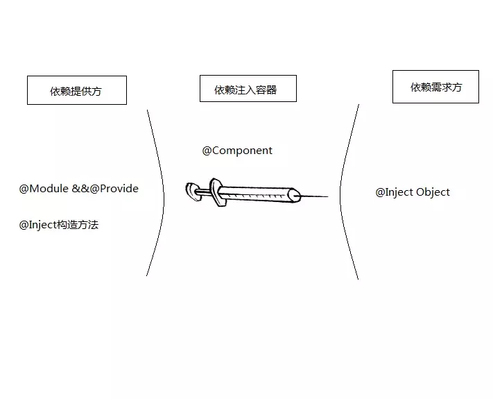

# 注解

## 注解的定义

Java 注解用于为 Java 代码提供元数据。作为元数据，注解不直接影响你的代码执行，但也有一些类型的注解实际上可以用于这一目的。Java 注解是从 Java5 开始添加到 Java 的。

## 注解即标签

如果把代码想象成一个具有生命的个体，注解就是给这些代码的某些个体打标签

## 如何自定义注解
* 注解通过 @interface关键字进行定义。

```java
public @interface Test {
}
```

它的形式跟接口很类似，不过前面多了一个 @ 符号。上面的代码就创建了一个名字为 Test 的注解。
你可以简单理解为创建了一张名字为 Test的标签。

* 使用注解

```java
@Test
public class TestAnnotation {
}
```

创建一个类 TestAnnotation,然后在类定义的地方加上 @Test就可以用 Test注解这个类了

你可以简单理解为将 Test 这张标签贴到 TestAnnotation这个类上面。

## 元注解

元注解是可以注解到注解上的注解，或者说元注解是一种基本注解，但是它能够应用到其它的注解上面。

如果难于理解的话，你可以这样理解。元注解也是一张标签，但是它是一张特殊的标签，它的作用和目的就是给其他普通的标签进行解释说明的。

元标签有 @Retention、@Documented、@Target、@Inherited、@Repeatable 5 种。

* @Retention

  Retention 的英文意为保留期的意思。当 @Retention 应用到一个注解上的时候，它解释说明了这个注解的的存活时间。

  它的取值如下：

  1. RetentionPolicy.SOURCE 注解只在源码阶段保留，在编译器进行编译时它将被丢弃忽视。

  2. RetentionPolicy.CLASS 注解只被保留到编译进行的时候，它并不会被加载到 JVM 中。

  3. RetentionPolicy.RUNTIME 注解可以保留到程序运行的时候，它会被加载进入到 JVM 中，所以在程序运行时可以获取到它们

     java  - source被丢弃 -> class - class被丢弃 > jvm （runtime）

  

* @Target

  Target 是目标的意思，@Target 指定了注解运用的地方
  你可以这样理解，当一个注解被 @Target 注解时，这个注解就被限定了运用的场景。
  类比到标签，原本标签是你想张贴到哪个地方就到哪个地方，但是因为 @Target 的存在，它张贴的地方就非常具体了，比如只能张贴到方法上、类上、方法参数上等等。@Target 有下面的取值

	1. ElementType.ANNOTATION_TYPE 可以给一个注解进行注解
	2. ElementType.CONSTRUCTOR 可以给构造方法进行注解
	3. ElementType.FIELD 可以给属性进行注解
	4. ElementType.LOCAL_VARIABLE 可以给局部变量进行注解
	5. ElementType.METHOD 可以给方法进行注解
	6. ElementType.PACKAGE 可以给一个包进行注解
	7. ElementType.PARAMETER 可以给一个方法内的参数进行注解

* @Documented

   顾名思义，这个元注解肯定是和文档有关。它的作用是能够将注解中的元素包含到 Javadoc 中去。ElementType.TYPE 可以给一个类型进行注解，比如类、接口、枚举

* @Inherited

  Inherited 是继承的意思，但是它并不是说注解本身可以继承，而是说如果一个超类被 @Inherited 注解过的注解进行注解的话，那么如果它的子类没有被任何注解应用的话，那么这个子类就继承了超类的注解。

* @Repeatable

  Repeatable 自然是可重复的意思。@Repeatable 是 Java 1.8 才加进来的，所以算是一个新的特性。

  什么样的注解会多次应用呢？通常是注解的值可以同时取多个。

## 注解的属性

注解的属性也叫做成员变量。注解只有成员变量，没有方法。
需要注意的是，在注解中定义属性时它的类型必须是 8 种基本数据类型外加 类、接口、注解及它们的数组
注解中属性可以有默认值，默认值需要用 default 关键值指定

```java
@Target(ElementType.TYPE)
@Retention(RetentionPolicy.RUNTIME)
public @interface Test{
int id() default -1;
String msg() default "Hello";
}
```
上面代码定义了 TestAnnotation 这个注解中拥有 id 和 msg 两个属性。在使用的时候，我们应该给它们进行赋值。
赋值的方式是在注解的括号内以 value="" 形式，多个属性之前用 ，隔开

```java
@Test(id=1,msg="hello annotation")
public class TestAnnotation {
}
```
## 注解的提取

注解与反射。
注解通过反射获取。首先可以通过 Class 对象的 isAnnotationPresent() 方法判断它是否应用了某个注解

```java
public boolean isAnnotationPresent(Class<? extends Annotation> annotationClass) {}
```

然后通过 getAnnotation() 方法来获取 Annotation 对象。
```java
 public <A extends Annotation> A getAnnotation(Class<A> annotationClass) {}
```
或者是 getAnnotations() 方法。
```java
public Annotation[] getAnnotations() {}
```
前一种方法返回指定类型的注解，后一种方法返回注解到这个元素上的所有注解。

如果获取到的 Annotation 如果不为 null，则就可以调用它们的属性方法了。比如
```java
@Test()
public class TestDemo{
	
public static void main(String[] args) {
	boolean hasAnnotation = 			 	TestDemo.class.isAnnotationPresent(Test.class);
		if ( hasAnnotation ) {
			TestAnnotation testAnnotation = 	TestDemo.class.getAnnotation(Test.class);
			System.out.println("id:"+testAnnotation.id());
			System.out.println("msg:"+testAnnotation.msg());
		}
	}
}
```
## 注解的使用场景
- 提供信息给编译器： 编译器可以利用注解来探测错误和警告信息
- 编译阶段时的处理： 软件工具可以用来利用注解信息来生成代码、Html文档或者做其它相应处理。
- 运行时的处理： 某些注解可以在程序运行的时候接受代码的提取
值得注意的是，注解不是代码本身的一部分。

# 反射
## 什么是反射？
反射 (Reflection) 是 Java 的特征之一，它允许运行中的 Java 程序获取自身的信息，并且可以操作类或对象的内部属性
简而言之，通过反射，我们可以在运行时获得程序或程序集中每一个类型的成员和成员的信息。程序中一般的对象的类型都是在编译期就确定下来的，而 Java 反射机制可以动态地创建对象并调用其属性，这样的对象的类型在编译期是未知的。所以我们可以通过反射机制直接创建对象，即使这个对象的类型在编译期是未知的。
反射的核心是 JVM 在运行时才动态加载类或调用方法/访问属性，它不需要事先（写代码的时候或编译期）知道运行对象是谁。
Java 反射主要提供以下功能：

- 在运行时判断任意一个对象所属的类；
- 在运行时构造任意一个类的对象；
- 在运行时判断任意一个类所具有的成员变量和方法（通过反射甚至可以调用private方法）；
- 在运行时调用任意一个对象的方法
重点：**是运行时而不是编译时**
## 反射的运用
### 获得 Class 对象
- 使用 Class 类的 `forName` 静态方法
```java
public static Class<?> forName(String className)
```
- 直接获取某一个对象的 class
```java
Class<?> klass = int.class;
Class<?> classInt = Integer.TYPE;
```
- 调用某个对象的 `getClass()` 方法
```java
StringBuilder str = new StringBuilder("123");
Class<?> klass = str.getClass();
```
### 判断是否为某个类的实例
一般地，我们用 `instanceof` 关键字来判断是否为某个类的实例。同时我们也可以借助反射中 Class 对象的 `isInstance()` 方法来判断是否为某个类的实例，它是一个 native 方法：
```java
public native boolean isInstance(Object obj);
```
### 创建实例
通过反射来生成对象主要有两种方式。
- 使用Class对象的newInstance()方法来创建Class对象对应类的实例。
```java
Class<?> c = String.class;
Object str = c.newInstance();
```
- 先通过Class对象获取指定的Constructor对象，再调用Constructor对象的newInstance()方法来创建实例。这种方法可以用指定的构造器构造类的实例。
```java
//获取String所对应的Class对象
Class<?> c = String.class;
//获取String类带一个String参数的构造器
Constructor constructor = c.getConstructor(String.class);
//根据构造器创建实例
Object obj = constructor.newInstance("23333");
System.out.println(obj);
```
### 获取构造器信息

得到构造器的方法

```java
Constructor getConstructor(Class[] params) -- 获得使用特殊的参数类型的公共构造函数， 
Constructor[] getConstructors() -- 获得类的所有公共构造函数 
Constructor getDeclaredConstructor(Class[] params) -- 获得使用特定参数类型的构造函数(与接入级别无关) 
Constructor[] getDeclaredConstructors() -- 获得类的所有构造函数(与接入级别无关)
```

获取类构造器的用法与上述获取方法的用法类似。主要是通过Class类的getConstructor方法得到Constructor类的一个实例，而Constructor类有一个newInstance方法可以创建一个对象实例:
```java
public T newInstance(Object ... initargs)
```
### 获取类的成员变量（字段）信息

获得字段信息的方法

```java
Field getField(String name) -- 获得命名的公共字段 
Field[] getFields() -- 获得类的所有公共字段 
Field getDeclaredField(String name) -- 获得类声明的命名的字段 
Field[] getDeclaredFields() -- 获得类声明的所有字段 
```

### 调用方法

获得方法信息的方法

```java
Method getMethod(String name, Class[] params) -- 使用特定的参数类型，获得命名的公共方法 
Method[] getMethods() -- 获得类的所有公共方法 
Method getDeclaredMethod(String name, Class[] params) -- 使用特写的参数类型，获得类声明的命名的方法 
Method[] getDeclaredMethods() -- 获得类声明的所有方法 
```

当我们从类中获取了一个方法后，我们就可以用 `invoke()` 方法来调用这个方法。`invoke` 方法的原型为:
```java
public Object invoke(Object obj, Object... args)
        throws IllegalAccessException, IllegalArgumentException,
           InvocationTargetException
```
### 利用反射创建数组
数组在Java里是比较特殊的一种类型，它可以赋值给一个Object Reference
其中的Array类为java.lang.reflect.Array类。我们通过Array.newInstance()创建数组对象，它的原型是:
```java
public static Object newInstance(Class<?> componentType, int length)
        throws NegativeArraySizeException {
        return newArray(componentType, length);
    }
```
而 `newArray` 方法是一个 native 方法，它在 HotSpot JVM 里的具体实现我们后边再研究，这里先把源码贴出来：
```java
private static native Object newArray(Class<?> componentType, int length)
        throws NegativeArraySizeException;
```
### 注意事项
- 反射会额外消耗一定的系统资源，因此如果不需要动态地创建一个对象，那么就不需要用反射
- 反射调用方法时可以忽略权限检查，因此可能会破坏封装性而导致安全问题

# 依赖注入

### 什么是依赖（Dependency）？

依赖是类与类之间的连接，依赖关系表示一个类依赖于另一个类的定义，通俗来讲

就是一种需要，例如一个人(Person)可以买车(Car)和房子(House),Person类依赖于Car类和House类

```java
public static void main(String ... args){
        //TODO:

    Person person = new Person();
    person.buy(new House());
    person.buy(new Car());

}

static class Person{

    //表示依赖House
    public void buy(House house){}
    //表示依赖Car
    public void buy(Car car){}
}

static class House{

}

static class Car{

}
```

### 依赖倒置 (Dependency inversion principle)

依赖倒置是面向对象设计领域的一种软件设计原则

软件设计有 6 大设计原则，合称 **SOLID**

**1、单一职责原则（Single Responsibility Principle，简称SRP ）**

- **核心思想:** 应该有且仅有一个原因引起类的变更
- **问题描述：** 假如有类Class1完成职责T1，T2，当职责T1或T2有变更需要修改时，有可能影响到该类的另外一个职责正常工作。
- **好处：** 类的复杂度降低、可读性提高、可维护性提高、扩展性提高、降低了变更引起的风险。
- **需注意：** 单一职责原则提出了一个编写程序的标准，用“职责”或“变化原因”来衡量接口或类设计得是否优良，但是“职责”和“变化原因”都是不可以度量的，因项目和环境而异。

**2、里氏替换原则（Liskov Substitution Principle,简称LSP）**

- **核心思想：** 在使用基类的的地方可以任意使用其子类，能保证子类完美替换基类。
- **通俗来讲：** 只要父类能出现的地方子类就能出现。反之，父类则未必能胜任。
- **好处：** 增强程序的健壮性，即使增加了子类，原有的子类还可以继续运行。
- **需注意：** 如果子类不能完整地实现父类的方法，或者父类的某些方法在子类中已经发生“畸变”，则建议断开父子继承关系 采用依赖、聚合、组合等关系代替继承。

**3、依赖倒置原则（Dependence Inversion Principle,简称DIP）**

- **核心思想**：高层模块不应该依赖底层模块，二者都该依赖其抽象；抽象不应该依赖细节；细节应该依赖抽象；
- **说明**：高层模块就是调用端，低层模块就是具体实现类。抽象就是指接口或抽象类。细节就是实现类。
- **通俗来讲：** 依赖倒置原则的本质就是通过抽象（接口或抽象类）使个各类或模块的实现彼此独立，互不影响，实现模块间的松耦合。
- **问题描述：** 类A直接依赖类B，假如要将类A改为依赖类C，则必须通过修改类A的代码来达成。这种场景下，类A一般是高层模块，负责复杂的业务逻辑；类B和类C是低层模块，负责基本的原子操作；假如修改类A，会给程序带来不必要的风险。
- **解决方案：** 将类A修改为依赖接口interface，类B和类C各自实现接口interface，类A通过接口interface间接与类B或者类C发生联系，则会大大降低修改类A的几率。
- **好处**：依赖倒置的好处在小型项目中很难体现出来。但在大中型项目中可以减少需求变化引起的工作量。使并行开发更友好。

**4、接口隔离原则（Interface Segregation Principle,简称ISP）**

- **核心思想**：类间的依赖关系应该建立在最小的接口上
- **通俗来讲：** 建立单一接口，不要建立庞大臃肿的接口，尽量细化接口，接口中的方法尽量少。也就是说，我们要为各个类建立专用的接口，而不要试图去建立一个很庞大的接口供所有依赖它的类去调用。
- **问题描述：** 类A通过接口interface依赖类B，类C通过接口interface依赖类D，如果接口interface对于类A和类B来说不是最小接口，则类B和类D必须去实现他们不需要的方法。
- **需注意：**
- **接口尽量小，但是要有限度**。对接口进行细化可以提高程序设计灵活性，但是如果过小，则会造成接口数量过多，使设计复杂化。所以一定要适度
- **提高内聚，减少对外交互**。使接口用最少的方法去完成最多的事情
- **为依赖接口的类定制服务**。只暴露给调用的类它需要的方法，它不需要的方法则隐藏起来。只有专注地为一个模块提供定制服务，才能建立最小的依赖关系。

**5、迪米特法则（Law of Demeter,简称LoD）**

- **核心思想：** 类间解耦。
- **通俗来讲：** 一个类对自己依赖的类知道的越少越好。自从我们接触编程开始，就知道了软件编程的总的原则：低耦合，高内聚。无论是面向过程编程还是面向对象编程，只有使各个模块之间的耦合尽量的低，才能提高代码的复用率。低耦合的优点不言而喻，但是怎么样编程才能做到低耦合呢？那正是迪米特法则要去完成的。

**6、开放封闭原则（Open Close Principle,简称OCP）**

- **核心思想：** 尽量通过扩展软件实体来解决需求变化，而不是通过修改已有的代码来完成变化
- **通俗来讲：** 一个软件产品在生命周期内，都会发生变化，既然变化是一个既定的事实，我们就应该在设计的时候尽量适应这些变化，以提高项目的稳定性和灵活性。

依赖倒置原则的定义如下：

> 1. 上层模块不应该依赖底层模块，它们都应该依赖于抽象。
> 2. 抽象不应该依赖于细节，细节应该依赖于抽象。

### 什么是上层模块和底层模块？

不管你承认不承认，“有人的地方就有江湖”，我们都说人人平等，但是对于任何一个组织机构而言，它一定有架构的设计有职能的划分。按照职能的重要性，自然而然就有了上下之分。并且，随着模块的粒度划分不同这种上层与底层模块会进行变动，也许某一模块相对于另外一模块它是底层，但是相对于其他模块它又可能是上层


公司管理层就是上层，CEO 是整个事业群的上层，那么 CEO 职能之下就是底层。

然后，我们再以事业群为整个体系划分模块，各个部门经理以上部分是上层，那么之下的组织都可以称为底层。

由此，我们可以看到，在一个特定体系中，上层模块与底层模块可以按照决策能力高低为准绳进行划分。

那么，映射到我们软件实际开发中，一般我们也会将软件进行模块划分，比如业务层、逻辑层和数据层。 


业务层中是软件真正要进行的操作，也就是**做什么**。 
逻辑层是软件现阶段为了业务层的需求提供的实现细节，也就是**怎么做**。 
数据层指业务层和逻辑层所需要的数据模型。

因此，如前面所总结，按照决策能力的高低进行模块划分。业务层自然就处于上层模块，逻辑层和数据层自然就归类为底层。 

### 什么是抽象和细节？

象如其名字一样，是一件很抽象的事物。抽象往往是相对于具体而言的，具体也可以被称为细节，当然也被称为具象。

比如： 
1. 这是一幅画。画是抽象，而油画、素描、国画而言就是具体。 
2. 这是一件艺术品，艺术品是抽象，而画、照片、瓷器等等就是具体了。 
3. 交通工具是抽象，而公交车、单车、火车等就是具体了。 
4. 表演是抽象，而唱歌、跳舞、小品等就是具体。

上面可以知道，抽象可以是物也可以是行为。

具体映射到软件开发中，抽象可以是接口或者抽象类形式。

```java
/**
 * Driveable 是接口，所以它是抽象
 */
public interface Driveable {
    void drive();
}
```

```java
/**
 * 而 Bike 实现了接口，它们被称为具体。
 */
public class Bike implements Driveable {
    @Override
    public void drive() {
        System.out.println("Bike drive");
    }
}
```

```java
/**
 * 而 Car实现了接口，它们被称为具体。
 */
public class Car implements Driveable {
    @Override
    public void drive() {
        System.out.println("Car drive.");
    }
}
```

### 依赖倒置的好处

在平常的开发中，我们大概都会这样编码。

```java
public class Person {

    private Bike mBike;
    private Car mCar;
    private Train mTrain;

    public Person(){
        mBike = new Bike();
        //mCar = new Car();
//        mTrain = new Train();
    }

    public void goOut(){
        System.out.println("出门啦");
        mBike.drive();
        //mCar.drive();
//        mTrain.drive();
    }

    public static void main(String ... args){
            //TODO:
        Person person = new Person();
        person.goOut();
    }
}
```

我们创建了一个 Person 类，它拥有一台自行车，出门的时候就骑自行车。

不过，自行车适应很短的距离。如果，我要出门逛街呢？自行车就不大合适了。于是就要改成汽车。

不过，如果我要到北京去，那么汽车也不合适了。

有没有一种方法能让 Person 的变动少一点呢？因为这是最基础的演示代码，如果工程大了，代码复杂了，Person 面对需求变动时改动的地方会更多。

而依赖倒置原则正好适用于解决这类情况。

下面，我们尝试运用依赖倒置原则对代码进行改造。

我们再次回顾下它的定义。

上层模块不应该依赖底层模块，它们都应该依赖于抽象。
抽象不应该依赖于细节，细节应该依赖于抽象。
首先是上层模块和底层模块的拆分。

按照决策能力高低或者重要性划分，Person 属于上层模块，Bike、Car 和 Train 属于底层模块。

上层模块不应该依赖于底层模块。 

```java
public class Person {

//    private Bike mBike;
    private Car mCar;
    private Train mTrain;
    private Driveable mDriveable;

    public Person(){
//        mBike = new Bike();
        //mCar = new Car();
       mDriveable = new Train();
    }

    public void goOut(){
        System.out.println("出门啦");
        mDriveable.drive();
        //mCar.drive();
//        mTrain.drive();
    }

    public static void main(String ... args){
            //TODO:
        Person person = new Person();
        person.goOut();
    }
}
```

可以看到，依赖倒置实质上是**面向接口编程的体现**。

### 控制反转 （IoC）

控制反转 IoC 是 Inversion of Control的缩写，意思就是对于控制权的反转，对么控制权是什么控制权呢？ 

Person自己掌控着内部 mDriveable 的实例化。 
现在，我们可以更改一种方式。将 mDriveable 的实例化移到 Person 外面。

```java
public class Person2 {

    private Driveable mDriveable;

    public Person2(Driveable driveable){
        this.mDriveable = driveable;
    }

    public void goOut(){
        System.out.println("出门啦");
        mDriveable.drive();
        //mCar.drive();
//        mTrain.drive();
    }

    public static void main(String ... args){
            //TODO:
        Person2 person = new Person2(new Car());
        person.goOut();
    }
}
```

就这样无论出行方式怎么变化，Person 这个类都不需要更改代码了。

在上面代码中，Person 把内部依赖的创建权力移交给了 Person2这个类中的 main() 方法。也就是说 Person 只关心依赖提供的功能，但并不关心依赖的创建。

这种思想其实就是 IoC，IoC 是一种新的设计模式，它对上层模块与底层模块进行了更进一步的解耦。控制反转的意思是反转了上层模块对于底层模块的依赖控制。 

比如上面代码，Person 不再亲自创建 Driveable 对象，它将依赖的实例化的权力交接给了 Person2。而 Person2在 IoC 中又指代了 **IoC 容器** 这个概念。

### 依赖注入（Dependency injection）

依赖注入，也经常被简称为 DI，其实在上一节中，我们已经见到了它的身影。它是一种实现 IoC 的手段。什么意思呢？

为了不因为依赖实现的变动而去修改 Person，也就是说以可能在 Driveable 实现类的改变下不改动 Person 这个类的代码，尽可能减少两者之间的耦合。我们需要采用上一节介绍的 IoC 模式来进行改写代码。

这个需要我们移交出对于依赖实例化的控制权，那么依赖怎么办？Person 无法实例化依赖了，它就需要在外部（IoC 容器）赋值给它，这个赋值的动作有个专门的术语叫做注入（injection），需要注意的是在 IoC 概念中，这个注入依赖的地方被称为 IoC 容器，但在依赖注入概念中，一般被称为注射器 （injector)。

**表达通俗一点就是：我不想自己实例化依赖，你（injector）创建它们，然后在合适的时候注入给我**

实现依赖注入有 3 种方式： 
1. 构造函数中注入 
2. setter 方式注入 
3. 接口注入

```java
/**
 * 接口方式注入
 * 接口的存在，表明了一种依赖配置的能力。
 */
public interface DepedencySetter {
    void set(Driveable driveable);
}
```

```java
public class Person2  implements DepedencySetter {

    //接口方式注入
    @Override
    public void set(Driveable driveable) {
        this.mDriveable = mDriveable;
    }

    private Driveable mDriveable;

    //构造函数注入
    public Person2(Driveable driveable){
        this.mDriveable = driveable;
    }

    //setter 方式注入
    public void setDriveable(Driveable mDriveable) {
        this.mDriveable = mDriveable;
    }

    public void goOut(){
        System.out.println("出门啦");
        mDriveable.drive();
        //mCar.drive();
//        mTrain.drive();
    }

    public static void main(String ... args){
            //TODO:
        Person2 person = new Person2(new Car());
        person.goOut();
    }
}
```

# Java 依赖注入标准

JSR-330 是 Java 的依赖注入标准。定义了如下的术语描述依赖注入：

- A 类型依赖 B类型（或者说 B 被 A 依赖），则 A类型 称为”依赖(物) dependency”
- 运行时查找依赖的过程，称为”解析 resolving“依赖
- 如果找不到依赖的实例，称该依赖是”不能满足的 unsatisfied”
- 在”依赖注入 dependency injection”机制中，提供依赖的工具称为”依赖注入器 dependency injector，注射器”

> 在标准中, 依赖是类型而不是实例/对象; 在程序中（运行时）, 需要的是依赖的实例.

### javax.inject

 包 javax.inject 指定了获取对象的一种方法，该方法与构造器、工厂以及服务定位器（例如 JNDI））这些传统方法相比可以获得更好的可重用性、可测试性以及可维护性。此方法的处理过程就是大家熟知的依赖注入，它对于大多数应用是非常有价值的。

### @Inject

 注解 @Inject
标识了可注入的构造器、方法或字段。可以用于静态或实例成员。一个可注入的成员可以被任何访问修饰符（private、package-
private、protected、public）修饰。注入顺序为构造器，字段，最后是方法。超类的字段、方法将优先于子类的字段、方法被注入。对于
同一个类的字段是不区分注入顺序的，同一个类的方法亦同

### Provider<T>

 接口 Provider 用于提供类型 T 的实列。Provider 是一般情况是由注入器实现的。对于任何可注入的 T 而言，您也可以注入 Provider<T>。与直接注入 T 相比，注入 Provider<T> 使得：
-  可以返回多个实例。
-  实例的返回可以延迟化或可选
-  打破循环依赖。
-  可以在一个已知作用域的实例内查询一个更小作用域内的实例。
```java
    class Car {
       @Inject Car(Provider<Seat> seatProvider) {
            Seat driver = seatProvider.get();
            Seat passenger = seatProvider.get();
           …
	}
}
```
* get()
  用于提供一个完全构造的类型 T 的实例。
  异常抛出：RuntimeException —— 当注入器在提供实例时遇到错误将抛出此异常。例如，对于一个可注入的成员 T
  抛出了一个异常，注入器将包装此异常并将它抛给 get()
  的调用者。调用者不应该尝试处理此类异常，因为不同注入器实现的行为不一样，即使是同一个注入器，也会因为配置不同而表现的行为不同。

### @Qualifier
用于标识限定器注解。任何人都可以定义新的限定器注解。一个限定器注解：
 - 是被 @Qualifier、@Retention(RUNTIME) 标注的，通常也被 @Documented 标注。
 - 可以拥有属性。
 - 可能是公共 API 的一部分，就像依赖类型一样，而不像类型实现那样不作为公共 API 的一部分。
 - 如果标注了 @Target 可能会有一些用法限制。本规范只是指定了限定器注解可以被使用在字段和参数上，但一些注入器配置可能使用限定器注解在其他一些地方（例如方法或类）上。

### @Named
  - 基于 String 的[限定器]
### @Scope
  -  用于标识作用域注解。一个作用域注解是被标识在包含一个可注入构造器的类上的，用于控制该类型的实例如何被注入器重用。缺省情况下，如果没有标识作用域注解，注入器将为每一次注入都创建（通过注入类型的构造器）新实例，并不重用已有实例。如果多个线程都能够访问一个作用域内的实例，该实例实现应该是线程安全的。作用域实现由注入器完成。

### @Singleton
  - 标识了注入器只实例化一次的类型。该注解不能被继承

# Dagger2

Dagger2起源于Dagger，是一款基于Java注解来实现的完全在编译阶段完成依赖注入的开源库，主要用于模块间解耦、提高代码的健壮性和可维护性。Dagger2在编译阶段通过apt利用Java注解自动生成Java代码，然后结合手写的代码来自动帮我们完成依赖注入的工作。

起初Square公司受到Guice的启发而开发了Dagger，但是Dagger这种半静态半运行时的框架还是有些性能问题（虽说依赖注入是完全静态的，但是其有向无环图(Directed Acyclic Graph)还是基于反射来生成的，这无论在大型的服务端应用还是在Android应用上都不是最优方案）。因此Google工程师Fork了Dagger项目，对它进行了改造。于是变演变出了今天我们要讨论的Dagger2，所以说Dagger2其实就是高配版的Dagger。

### Dagger2注解

Dagger2是基于Java注解来实现依赖注入的，那么在正式使用之前我们需要先了解下Dagger2中的注解。Dagger2使用过程中我们通常接触到的注解主要包括：@Inject, @Module, @Provides, @Component, @Qulifier, @Scope, @Singleten。

- @Inject：@Inject有两个作用，一是用来标记需要依赖的变量，以此告诉Dagger2为它提供依赖；二是用来标记构造函数，Dagger2通过@Inject注解可以在需要这个类实例的时候来找到这个构造函数并把相关实例构造出来，以此来为被@Inject标记了的变量提供依赖；
- @Module：@Module用于标注提供依赖的类。你可能会有点困惑，上面不是提到用@Inject标记构造函数就可以提供依赖了么，为什么还需要@Module？很多时候我们需要提供依赖的构造函数是第三方库的，我们没法给它加上@Inject注解，又比如说提供以来的构造函数是带参数的，如果我们之所简单的使用@Inject标记它，那么他的参数又怎么来呢？@Module正是帮我们解决这些问题的。
- @Provides：@Provides用于标注Module所标注的类中的方法，该方法在需要提供依赖时被调用，从而把预先提供好的对象当做依赖给标注了@Inject的变量赋值；
- @Component：@Component用于标注接口，是依赖需求方和依赖提供方之间的桥梁。被Component标注的接口在编译时会生成该接口的实现类（如果@Component标注的接口为CarComponent，则编译期生成的实现类为DaggerCarComponent）,我们通过调用这个实现类的方法完成注入；
- @Qulifier：@Qulifier用于自定义注解，也就是说@Qulifier就如同Java提供的几种基本元注解一样用来标记注解类。我们在使用@Module来标注提供依赖的方法时，方法名我们是可以随便定义的（虽然我们定义方法名一般以provide开头，但这并不是强制的，只是为了增加可读性而已）。那么Dagger2怎么知道这个方法是为谁提供依赖呢？答案就是返回值的类型，Dagger2根据返回值的类型来决定为哪个被@Inject标记了的变量赋值。但是问题来了，一旦有多个一样的返回类型Dagger2就懵逼了。@Qulifier的存在正式为了解决这个问题，我们使用@Qulifier来定义自己的注解，然后通过自定义的注解去标注提供依赖的方法和依赖需求方（也就是被@Inject标注的变量），这样Dagger2就知道为谁提供依赖了。----一个更为精简的定义：当类型不足以鉴别一个依赖的时候，我们就可以使用这个注解标示；
- @Scope：@Scope同样用于自定义注解，我能可以通过@Scope自定义的注解来限定注解作用域，实现局部的单例；
- @Singleton：@Singleton其实就是一个通过@Scope定义的注解，我们一般通过它来实现全局单例。但实际上它并不能提前全局单例，是否能提供全局单例还要取决于对应的Component是否为一个全局对象。

我们提到@Inject和@Module都可以提供依赖，那如果我们即在构造函数上通过标记@Inject提供依赖，有通过@Module提供依赖Dagger2会如何选择呢？具体规则如下：

- 步骤1：首先查找@Module标注的类中是否存在提供依赖的方法。

- 步骤2：若存在提供依赖的方法，查看该方法是否存在参数。

- - a：若存在参数，则按从步骤1开始依次初始化每个参数；
  - b：若不存在，则直接初始化该类实例，完成一次依赖注入。


- 步骤3：若不存在提供依赖的方法，则查找@Inject标注的构造函数，看构造函数是否存在参数。

- - a：若存在参数，则从步骤1开始依次初始化每一个参数
  
  - b：若不存在，则直接初始化该类实例，完成一次依赖注入。
  



### Dagger2使用入门

**1、案例A**

Car类是需求依赖方，依赖了Engine类；因此我们需要在类变量Engine上添加@Inject来告诉Dagger2来为自己提供依赖。
Engine类是依赖提供方，因此我们需要在它的构造函数上添加@Inject
```java
public class Engine {

    /**
     * 二是用来标记构造函数，Dagger2通过@Inject注解可以在需要这个类实例的时候来找到这个构造函数并把相关实例构造出来，
     * 以此来为被@Inject标记了的变量提供依赖
     */
    @Inject
    Engine(){}

    @Override
    public String toString() {
        return "Engine{}";
    }

    public void run(){
        System.out.println("引擎转起来了~~~");
    }
}
```
接下来我们需要创建一个用@Component标注的接口CarComponent，这个CarComponent其实就是一个注入器，这里用来将Engine注入到Car中。
```java
@Component
public interface CarComponent {
    void inject(Car car);
}
```
完成这些之后我们需要Build下项目，让Dagger2帮我们生成相关的Java类。接着我们就可以在Car的构造函数中调用Dagger2生成的DaggerCarComponent来实现注入（这其实在前面Car类的代码中已经有了体现）
```java
public class Car {
    /**
     * @Inject：@Inject有两个作用，一是用来标记需要依赖的变量，以此告诉Dagger2为它提供依赖
     */
    @Inject
    Engine engine;

    public Car() {
        DaggerCarComponent.builder().build().inject(this);
    }

    public Engine getEngine() {
        return this.engine;
    }

    public static void main(String ... args){
        //TODO:
        Car car = new Car();
        System.out.println(car.getEngine());
    }
}
```

**2、案例B**

如果创建Engine的构造函数是带参数的呢？比如说制造一台引擎是需要齿轮(Gear)的。或者Eggine类是我们无法修改的呢？这时候就需要@Module和@Provide上场了。

同样我们需要在Car类的成员变量Engine上加上@Inject表示自己需要Dagger2为自己提供依赖；Engine类的构造函数上的@Inject也需要去掉，因为现在不需要通过构造函数上的@Inject来提供依赖了。
```java
public class Engine {

    private String name;

    @Inject
    Engine(){}

    Engine(String name) {
        this.name = name;
    }

    @Override
    public String toString() {
        return "Engine{" +
                "name='" + name + '\'' +
                '}';
    }

    public void run() {
        System.out.println("引擎转起来了~~~");
    }
}
```

接着我们需要一个Module类来生成依赖对象。前面介绍的@Module就是用来标准这个类的，而@Provide则是用来标注具体提供依赖对象的方法（这里有个不成文的规定，被@Provide标注的方法命名我们一般以provide开头，这并不是强制的但有益于提升代码的可读性）。
```java
@Module
public class MarkCarModule {

    public MarkCarModule(){ }

    /**
     * 用于标注Module所标注的类中的方法，该方法在需要提供依赖时被调用，从而把预先提供好的对象当做依赖给标注了@Inject的变量赋值
     * @return
     */
    @Provides
    Engine provideEngine(){
        return new Engine("gear");
    }
}
```
接下来我们还需要对CarComponent进行一点点修改，之前的@Component注解是不带参数的，现在我们需要加上modules = {MarkCarModule.class}，用来告诉Dagger2提供依赖的是MarkCarModule这个类。
```java
@Component(modules = MarkCarModule.class)
public interface CarComponent {
    void inject(Car car);
}
```
Car类的构造函数我们也需要修改，相比之前多了个markCarModule(new MarkCarModule())方法，这就相当于告诉了注入器DaggerCarComponent把MarkCarModule提供的依赖注入到了Car类中。
```java
public class Car {
    /**
     * 我们提到@Inject和@Module都可以提供依赖，那如果我们即在构造函数上通过标记@Inject提供依赖，有通过@Module提供依赖Dagger2会如何选择呢？具体规则如下：
     *
     * 步骤1：首先查找@Module标注的类中是否存在提供依赖的方法。
     * 步骤2：若存在提供依赖的方法，查看该方法是否存在参数。
     * a：若存在参数，则按从步骤1开始依次初始化每个参数；
     * b：若不存在，则直接初始化该类实例，完成一次依赖注入。
     *
     *
     * 步骤3：若不存在提供依赖的方法，则查找@Inject标注的构造函数，看构造函数是否存在参数。
     * a：若存在参数，则从步骤1开始依次初始化每一个参数
     * b：若不存在，则直接初始化该类实例，完成一次依赖注入
     */
    @Inject
    Engine engine;

    public Car() {
        DaggerCarComponent.builder().markCarModule(new MarkCarModule())
                .build().inject(this);
    }

    public Engine getEngine() {
        return this.engine;
    }

    public static void main(String ... args){
        //TODO:
        Car car = new Car();
        System.out.println(car.getEngine());
    }
}
```
这样一个最最基本的依赖注入就完成了，接下来我们测试下我们的代码。
输出
```text
Engine{name='gear'}
```

**3、案例C**

那么如果一台汽车有两个引擎（也就是说Car类中有两个Engine变量）怎么办呢？没关系，我们还有@Qulifier！首先我们需要使用Qulifier定义两个注解：
```java
public class Engine {

    /**
     * 用于自定义注解，也就是说@Qulifier就如同Java提供的几种基本元注解一样用来标记注解类。我们在使用@Module来标注提供依赖的方法时，方法名我们是可以随便定义的（虽然我们定义方法名一般以provide开头，但这并不是强制的，只是为了增加可读性而已）。那么Dagger2怎么知道这个方法是为谁提供依赖呢？答案就是返回值的类型，Dagger2根据返回值的类型来决定为哪个被@Inject标记了的变量赋值。但是问题来了，一旦有多个一样的返回类型Dagger2就懵逼了。@Qulifier的存在正式为了解决这个问题，我们使用@Qulifier来定义自己的注解，然后通过自定义的注解去标注提供依赖的方法和依赖需求方（也就是被@Inject标注的变量），这样Dagger2就知道为谁提供依赖了。----一个更为精简的定义：当类型不足以鉴别一个依赖的时候，我们就可以使用这个注解标示
     * 1. 使用@Qulifier定义两个注解
     */
    @Qualifier
    @Retention(RetentionPolicy.RUNTIME)
    public @interface QualifierA { }
    @Qualifier
    @Retention(RetentionPolicy.RUNTIME)
    public @interface QualifierB { }

    private String name;

    Engine(String name) {
        this.name = name;
    }

    @Override
    public String toString() {
        return "Engine{" +
                "name='" + name + '\'' +
                '}';
    }

    public void run() {
        System.out.println("引擎转起来了~~~");
    }
}
```
同时我们需要对依赖提供方做出修改
```java
@Module
public class MarkCarModule {

    public MarkCarModule(){ }

    /**
     * 2. 同时我们需要对依赖提供方做出修改
     * @return
     */
    @Engine.QualifierA
    @Provides
    Engine provideEngineA(){
        return new Engine("gearA");
    }

    @Engine.QualifierB
    @Provides
    Engine provideEngineB(){
        return new Engine("gearB");
    }
}
```
接下来依赖需求方Car类同样需要修改
```java
public class Car {
    /**
     * 3. 接下来依赖需求方Car类同样需要修改
     */
    @Engine.QualifierA
    @Inject
    Engine engineA;

    @Engine.QualifierB
    @Inject
    Engine engineB;

    public Car() {
        DaggerCarComponent.builder().markCarModule(new MarkCarModule())
                .build().inject(this);
    }

    public Engine getEngineA() {
        return this.engineA;
    }

    public Engine getEngineB() {
        return this.engineB;
    }

    public static void main(String... args) {
        //TODO:
        Car car = new Car();
        System.out.println(car.getEngineA());
        System.out.println(car.getEngineB());
    }
}
```
执行结果：
```text
Engine{name='gearA'}
Engine{name='gearB'}
```

**4、案例D**
接下来我们看看@Scope是如何限定作用域，实现局部单例的。
首先我们需要通过@Scope定义一个CarScope注解：
```java
public class Engine {


    /**
     * 用于自定义注解，我能可以通过@Scope自定义的注解来限定注解作用域，实现局部的单例
     * 1. @Scope定义一个CarScope注解
     */
    @Scope
    @Retention(RetentionPolicy.RUNTIME)
    public @interface CarScope {
    }

    private String name;

    Engine(String name) {
        this.name = name;
        System.out.println("Engine create: " + name);
    }

    @Override
    public String toString() {
        return "Engine{" +
                "name='" + name + '\'' +
                '}';
    }

    public void run() {
        System.out.println("引擎转起来了~~~");
    }
}
```
接着我们需要用这个@CarScope去标记依赖提供方MarkCarModule。
```java
@Module
public class MarkCarModule {

    public MarkCarModule(){ }

    /**
     * 2. @CarScope去标记依赖提供方MarkCarModule
     * @return
     */
    @Engine.CarScope
    @Provides
    Engine provideEngine(){
        return new Engine("gear");
    }

}
```
同时还需要使用@Scope去标注注入器Compoent
```java
/**
 * 3. 同时还需要使用@Scope去标注注入器Compoent
 */
@Engine.CarScope
@Component(modules = MarkCarModule.class)
public interface CarComponent {
    void inject(Car car);
}
```
```java
public class Car {

    @Inject
    Engine engineA;

    @Inject
    Engine engineB;

    public Car() {
        DaggerCarComponent.builder().markCarModule(new MarkCarModule())
                .build().inject(this);
    }

    public Engine getEngineA() {
        return this.engineA;
    }

    public Engine getEngineB() {
        return this.engineB;
    }

    public static void main(String... args) {
        //TODO:
        Car car = new Car();
        System.out.println(car.getEngineA());
        System.out.println(car.getEngineB());
    }
}
```
如果我们不适用@Scope,上面的代码会实例化两次Engine类，因此会有两次"Create Engine"输出。现在我们在有@Scope的情况测试下劳动成果：
输出
```text
Engine create: gear
Engine{name='gear'}
Engine{name='gear'}
```
#  Dagger与MVP
　对于一个应用而言我们需要对它抽象出各个层面，而在MVP架构中它将UI界面和数据进行隔离，所以我们的应用也就分为三个层次。

- View: 对于View层也是视图层，在View层中只负责对数据的展示，提供友好的界面与用户进行交互。在Android开发中通常将Activity或者Fragment作为View层。
- Model: 对于Model层也是数据层。它区别于MVC架构中的Model，在这里不仅仅只是数据模型。在MVP架构中Model它负责对数据的存取操作，例如对数据库的读写，网络的数据的请求等。
- Presenter:对于Presenter层他是连接View层与Model层的桥梁并对业务逻辑进行处理。在MVP架构中Model与View无法直接进行交互。所以在Presenter层它会从Model层获得所需要的数据，进行一些适当的处理后交由View层进行显示。这样通过Presenter将View与Model进行隔离，使得View和Model之间不存在耦合，同时也将业务逻辑从View中抽离。

　　下面通过MVP结构图来看一下MVP中各个层次之间的关系。 


在MVP架构中将这三层分别抽象到各自的接口当中。通过接口将层次之间进行隔离，而Presenter对View和Model的相互依赖也是依赖于各自的接口。这点符合了接口隔离原则，也正是面向接口编程。在Presenter层中包含了一个View接口，并且依赖于Model接口，从而将Model层与View层联系在一起。而对于View层会持有一个Presenter成员变量并且只保留对Presenter接口的调用，具体业务逻辑全部交由Presenter接口实现类中处理。

如果你的项目是采用MVP架构的，那么结合Dagger2将会是一件非常棒的体验，它让M-V-P进一步解藕，架构更清晰。